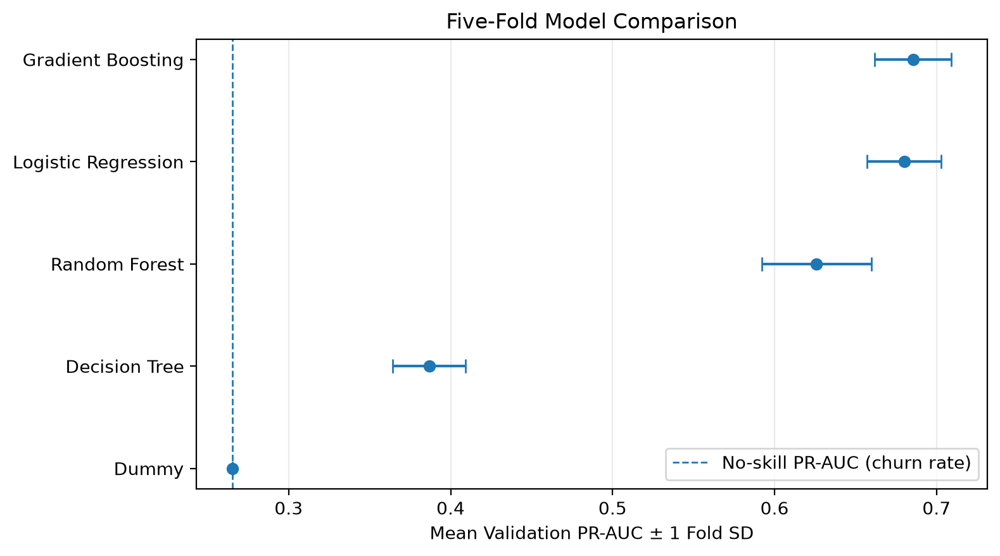
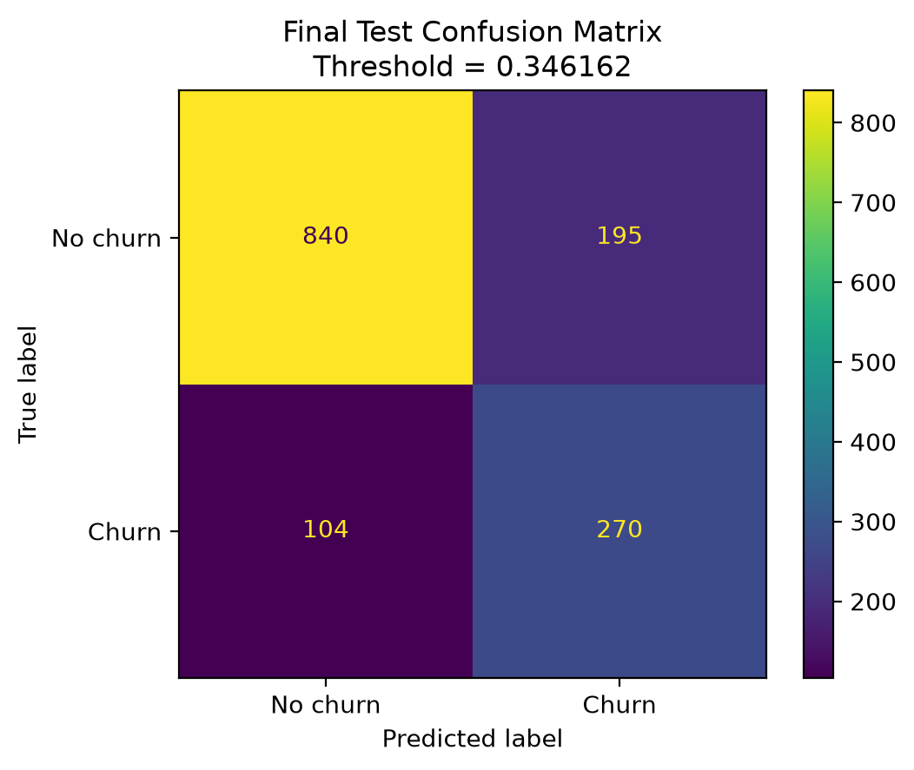
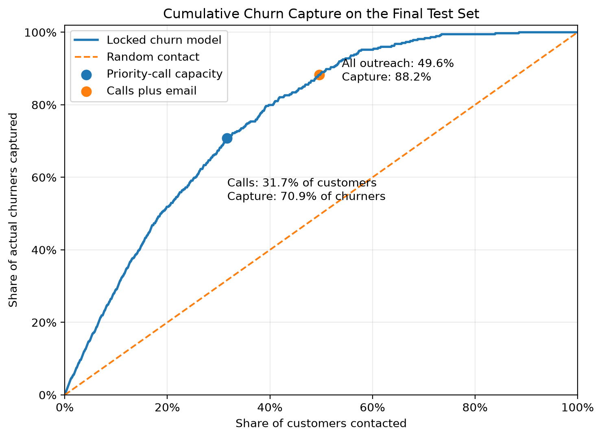
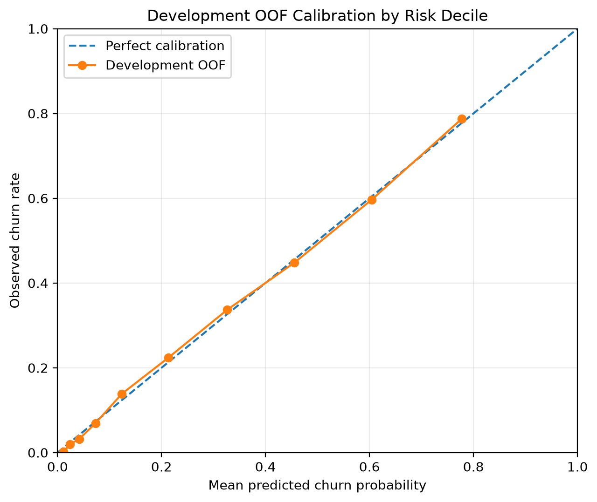

# Customer Churn Prediction and Retention Policy

## Project Overview

In this project, I built a customer churn prediction workflow using the IBM Telco Customer Churn dataset.

The goal was not only to predict which customers may churn. I also wanted to connect the model results to a practical retention policy.

The final workflow answers three main questions:

1. Which customers have the highest churn risk?
2. How many customers should the company contact?
3. Should a customer receive a personal call, an email, or no immediate action?

The dataset contains 7,043 customers. About 26.5 percent of the customers churned.

The final model was a gradient boosting classifier. The model was selected after comparison with logistic regression, decision tree, random forest, and a dummy baseline.

## Key Results

### Model Comparison

The tuned gradient boosting model achieved the strongest cross-validated PR-AUC among the evaluated models.



### Final Test Confusion Matrix

At the selected call threshold, the model correctly identified 270 churners while maintaining a manageable outreach population.



### Cumulative Churn Capture

The ranking analysis shows how many actual churners can be reached as the contacted share of customers increases.



### Probability Calibration

The development out-of-fold calibration analysis compares predicted churn risk with the observed churn rate across risk groups.



## Business Problem

Customer churn creates lost revenue and increases the cost of replacing customers.

A company may want to contact customers who have a high risk of leaving. However, contacting every customer is not realistic.

Personal calls are more expensive and require employee time. Emails are cheaper but may have a lower response rate.

Because of this, I created a two-level retention policy:

- Higher-risk customers receive a priority call.
- Medium-risk customers receive an email.
- Lower-risk customers receive no immediate action.

This makes the model useful for both prediction and workload planning.

## Dataset

The project uses the IBM Telco Customer Churn sample dataset.

The original dataset contains 33 columns. After reviewing the variables, I created a final model feature set with 19 predictors:

- 3 numeric features
- 16 categorical features

Examples of the predictors include:

- tenure
- monthly charges
- total charges
- contract type
- internet service
- payment method
- online security
- technical support
- dependents

The target variable is `Churn Value`, where:

- `1` means the customer churned
- `0` means the customer did not churn

The dataset is not included in this repository. Instructions for obtaining and placing the data are available in `data/README.md`.

## Leakage and Feature Selection

Before training the models, I reviewed the columns based on whether they would be available at the time of prediction.

Several columns were excluded because they could cause leakage or would not be appropriate for deployment.

Examples include:

- customer ID
- churn score
- churn reason
- churn category
- detailed geographic columns
- customer lifetime value
- constant or redundant columns

The customer ID is retained only for internal record matching and is not used as a model feature.

## Development and Test Split

The data was divided into:

- 5,634 development customers
- 1,409 final-test customers

The split used stratification so that the churn rate remained similar in both groups.

This notebook is a modern reconstruction of an earlier master workflow. It preserves the same development and test customer membership as the original project.

The test set was originally reserved during development. In this reconstruction, it is used only to reproduce the locked historical evaluation.

## Preprocessing

All preprocessing steps were placed inside scikit-learn pipelines.

Numeric features use:

- median imputation
- standard scaling for logistic regression

Categorical features use:

- missing-value replacement
- one-hot encoding
- `handle_unknown="ignore"`

Keeping preprocessing inside the pipeline helps prevent leakage during cross-validation and makes the fitted model easier to save and reuse.

## Models Compared

The following models were compared:

- Dummy classifier
- Logistic regression
- Decision tree
- Random forest
- Gradient boosting

Average Precision was used as the main model-selection metric because churn is the minority class.

The notebook labels this metric as PR-AUC for continuity with the original project, but the value is calculated with scikit-learn's `average_precision_score`.

ROC-AUC was also reported as a secondary ranking metric.

## Model Selection

Gradient boosting had the strongest repeated cross-validation performance.

Repeated five-fold cross-validation was run ten times to compare gradient boosting with logistic regression.

The average results were:

- Gradient boosting Average Precision: 0.6930
- Logistic regression Average Precision: 0.6800

Gradient boosting performed better in all ten repeats, so it was selected as the final model.

## Out-of-Fold Predictions

Out-of-fold predictions were created for the full development set.

These predictions were used to:

- evaluate development performance
- check calibration
- select decision thresholds
- estimate retention workload

This avoids selecting thresholds from the final test set.

The development out-of-fold Average Precision was approximately 0.6901.

## Calibration

The predicted probabilities were checked using:

- Brier score
- log loss
- calibration intercept
- calibration slope
- expected calibration error
- calibration tables

The development calibration results were acceptable, so no additional calibration model was added.

## Retention Thresholds

Three historical thresholds were preserved in the reconstruction:

- Binary classification threshold: 0.346162
- Priority-call threshold: 0.372611
- Email threshold: 0.165677

Customers with a predicted probability at or above the call threshold are assigned to the priority-call group.

Customers below the call threshold but at or above the email threshold are assigned to the email group.

Customers below the email threshold receive no immediate action.

## Final Test Results

The final model was evaluated on the 1,409-customer historically reserved test set.

| Metric | Result |
| --- | ---: |
| Average Precision, reported as PR-AUC | 0.676037 |
| ROC-AUC | 0.857063 |
| Precision | 58.06% |
| Recall | 72.19% |
| F1 score | 64.36% |
| True negatives | 840 |
| False positives | 195 |
| False negatives | 104 |
| True positives | 270 |

The model captured about 72 percent of the churners at the binary classification threshold.

Precision was about 58 percent, which means the retention team would also contact some customers who would not actually churn. This tradeoff is important because higher recall usually requires a larger workload.

## Final Retention Policy

The final test customers were divided into three action groups.

| Action group | Customers | Churners | Churn rate | Share of churners captured |
| --- | ---: | ---: | ---: | ---: |
| Priority call | 446 | 265 | 59.42% | 70.86% |
| Email only | 253 | 65 | 25.69% | 17.38% |
| No immediate action | 710 | 44 | 6.20% | 11.76% |

The combined call and email policy contacts 699 customers.

This represents 49.61 percent of the test customers and captures 88.24 percent of the churners.

The policy gives the company a way to balance churn coverage with the cost of customer contact.

## Model Interpretation

Permutation importance was used to evaluate which raw features were most useful to the fitted model.

The most important features included:

1. tenure
2. contract
3. dependents
4. total charges
5. online security
6. internet service
7. technical support
8. monthly charges

Partial-dependence plots were created using development customers as the reference population.

The tenure plot showed that the model assigns higher churn risk to newer customers. The modeled risk decreases as tenure increases.

The monthly-charges plot showed a nonlinear relationship. Risk remained fairly stable at lower charge levels and increased more strongly in the higher charge range.

These results describe the behavior of the fitted model. They should not be interpreted as causal effects.

## Local Customer Analysis

Two final-test cases were examined:

- a correctly identified high-risk churner
- a churner that the model missed

A fixed-reference block-replacement method was used to examine how groups of related features affected each prediction.

Examples of feature blocks include:

- customer lifecycle and contract
- internet-service bundle
- billing and payment
- household characteristics

The block results are diagnostic sensitivity comparisons. They are not SHAP values and they are not causal counterfactual outcomes.

## Deployment Design

The project also includes a basic deployment design.

The saved model uses a 19-feature input contract.

The batch-validation process checks:

- required columns
- unexpected columns
- numeric data types
- missing values
- unknown categories
- duplicate customer IDs

The model and policy are saved separately:

- `customer_churn_gb_v1_0_0.joblib`
- `retention_policy_v1_0_0.json`

The model artifact was reloaded and tested. The reloaded probabilities matched the original probabilities exactly.

## Monitoring

The notebook includes examples of data and prediction monitoring.

The monitored items include:

- numeric feature drift using PSI
- categorical distribution drift using total variation distance
- unknown-category rates
- missing-value changes
- prediction-score drift
- average predicted probability changes

A synthetic drifted dataset was created to confirm that the monitoring rules could detect important changes.

The notebook also separates data drift from delayed model-performance monitoring. Actual performance can only be measured after the true churn outcomes become available.

## Limitations and Next Steps

This project uses a public sample dataset from one telecommunications company, so the results may not generalize directly to other companies or future customer populations.

The model predicts which customers are likely to churn, but it does not estimate whether a retention action will change a customer's behavior.

The call and email policy is based on model scores and workload assumptions. A real company would also need verified contact costs, offer costs, customer value, and retention outcomes.

A useful next step would be a controlled A/B test that records which customers receive each retention action and whether they remain. With randomized treatment data, an uplift model could identify customers who are most likely to stay because of the intervention, rather than only identifying customers with high churn risk.

The locked model should also be evaluated on a new future customer cohort, with continued monitoring of calibration, feature drift, prediction drift, and business outcomes.
## Repository Structure

```text
customer-churn-retention/
├── README.md
├── customer_churn.ipynb
├── requirements.txt
├── .gitignore
├── artifacts/
│   ├── customer_churn_gb_v1_0_0.joblib
│   └── retention_policy_v1_0_0.json
├── data/
│   └── README.md
└── figures/
